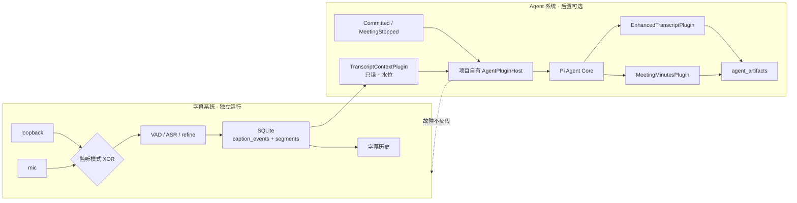
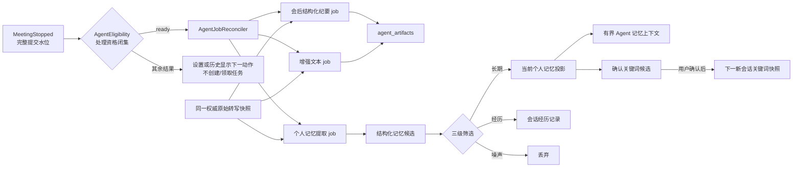

# Agent 插件、个人记忆与 Provider 架构

> 状态：已决定；由 [ADR 0003](adr/0003-project-owned-agent-plugin-host.md)、[ADR 0005](adr/0005-separate-recognition-and-agent-providers.md)、[ADR 0006](adr/0006-local-structured-personal-memory.md)、[ADR 0007](adr/0007-isolated-agent-core-mvp.md)、[ADR 0008](adr/0008-terminal-session-agent-job-reconciliation.md) 与 [ADR 0009](adr/0009-deterministic-agent-input-planning.md) 共同约束。SEM-F29/J23 隔离 Agent 内核开发入口为联合验收完成；D3 正式存储/生命周期、D4 会后结构化纪要与 D5 增强文本/个人记忆 UI-free 后端纵切为实现完成·尚未验收；正式产品接线、记忆检索、确认关键词与完整 J21/J22/J24 保持已决定
>
> 日期：2026-08-09
>
> 约束来源：[语义合同](semantic-contract.md) / [ADR 0002](adr/0002-separate-subtitle-and-agent-systems.md)

## 1. 结论

采用 **Pi Agent Core + 项目自有 AgentPluginHost + 第一方能力插件**，不要嵌入完整 `pi-coding-agent`，也不要把整个字幕系统变成 Pi 插件。

用户设想中的“语音插件”应精确拆成两部分：

- 字幕系统：独立产品内核，拥有互斥的 `loopback`/`mic` 采集、ASR、会话、SQLite 字幕事实和历史。它不依赖 Pi。
- 字幕上下文插件：Agent 侧的只读适配器，只把已经提交的文字按水位提供给 Pi。它不接触原始音频，也不控制 ASR。

会后结构化纪要、增强文本和个人记忆都是真正的 Agent 能力：它们读取同一固定字幕上下文，分别运行有界 Agent Loop，并把结果保存为独立 Agent 派生数据。首版另提供默认隐藏的调试聊天，但它只是验证入口，不是通用助手或自动记忆来源。

这组模式可称为：

- **Microkernel / Plugin Architecture**：Agent Loop 是微内核，业务能力由插件贡献。
- **Ports and Adapters / Hexagonal Architecture**：插件通过窄端口访问字幕、模型和产物存储。
- **Event-driven integration**：字幕提交、会话停止等应用事件触发可靠任务。
- **Capability-based security**：插件只拿到它声明且被批准的能力。

## 2. 推荐拓扑



主依赖方向始终是 `Agent → 已提交字幕`。虚线不是调用关系，而是故障隔离约束。

## 3. 首版插件模型

### 3.1 插件分类

| 类型 | 职责 | 首版实例 |
|---|---|---|
| `context-provider` | 把产品事实转换为 Agent 可用上下文，只读 | `transcript-context` |
| `artifact-generator` | 使用 LLM/Agent Loop 生成版本化内容产物 | `enhanced-transcript`、`meeting-minutes` |
| `memory-processor` | 从固定正文快照提取、筛选和合并个人记忆候选 | `memory-extraction`、`memory-consolidation` |
| `evaluator` | 校验产物结构、引用水位、空内容和质量下限 | 后续 `minutes-quality-gate` |

该分类借鉴 ElizaOS 的 providers/actions/evaluators/services，但不引入第二套 Agent runtime。持续音频采集不归为 Agent `service`，因为它必须在 Agent 完全关闭时仍成立。

### 3.2 概念清单

```json
{
  "id": "meeting-minutes",
  "version": "1.0.0",
  "apiVersion": "1",
  "kind": "artifact-generator",
  "activationEvents": ["onMeetingStopped", "onUserRequest"],
  "requires": ["transcript-context"],
  "permissions": ["transcript.read", "model.invoke", "artifact.write"],
  "contributes": ["artifact:meeting-minutes"],
  "failurePolicy": "isolate",
  "timeoutMs": 120000
}
```

权限采用白名单。未声明即不可用；首版不存在 `shell.execute`、`process.spawn`、`filesystem.write`、`network.fetch` 或 `external.write`。模型网络请求只能走宿主提供的 `ModelGateway`，内部产物只能走 `ArtifactWriter`。

### 3.3 插件上下文端口

插件只接触以下稳定能力：

- `TranscriptReader`：按 `sessionId + inputWatermark + transcriptVersion + digest` 读取已经提交的明确正文版本。
- `MemoryReader`：按启用状态、范围、类型和预算读取当前个人记忆投影。
- `ModelGateway`：由宿主管理 Agent 模型 provider、凭据、超时、取消和用量。
- `ArtifactWriter`：只写版本化 `agent_artifacts`，不能写 `caption_events/segments`。
- `MemoryCandidateSink`：只接受结构化候选；来源、合并、冲突与 SQLite 提交由宿主处理。
- `JobController`：只允许请求 registry 中已经登记的固定后台任务，不接受任意提示词或工具集。
- `Clock`、`Logger`：可测试的时间与去敏日志。
- `AbortSignal`：用户取消、超时或关机时有界结束。

SQLite 文件、Electron renderer、音频帧、ASR worker、`safeStorage` 和任意系统 API 都不直接暴露给插件。

## 4. 确定性触发而非 LLM 自主调度

首版的应用流程应为：

1. 用户停止会话。
2. storage worker 完成有界 flush，得到该会话的完整提交水位与 digest。
3. 应用层创建幂等 `meeting-minutes` job。
4. PluginHost 激活字幕上下文插件与纪要插件。
5. Pi Agent Loop 只在该 job 的受控上下文和内容型工具内迭代。
6. 结构校验通过后写入独立纪要；失败只记录 job 状态，字幕和历史不受影响。

是否需要总结由产品事件决定，不交给 LLM 猜测。待办只作为纪要字段输出，不注册“发邮件、建日程、改文件”等工具。

增强文本独立保存，A2 首版只做“会后/用户主动触发的整场增强”。按 committed segment 滚动增强后置，避免延迟、成本和迟到 refined 纠正同时进入第一版。

## 5. 与 Pi 内部框架的具体冲突

### 5.1 原设计的想法与本次变化

原设计把整个 Agent 层先收敛成一个可替换的 `AgentRuntime` 适配器，Pi 只作为低层 Loop 候选；字幕通过 SQLite 提交水位单向供给 Agent，Agent 工具受白名单控制。这样设计是因为字幕 MVP、Pi/Electron 兼容性、可靠消费和产品功能都还未冻结，先保住字幕独立性，避免过早把存储与某个 Agent 框架锁死。

本次插件化不是推翻原设计，而是把 `AgentRuntime` 内部细分为：

```text
AgentRuntime（对产品保持稳定）
└─ AgentPluginHost（清单 / 权限 / 生命周期 / registry）
   ├─ PiAgentAdapter（Agent Core / Loop）
   ├─ TranscriptContextPlugin
   ├─ MemoryContextPlugin
   ├─ EnhancedTranscriptPlugin
   ├─ MeetingMinutesPlugin
   ├─ MemoryExtractionPlugin
   └─ MemoryConsolidationPlugin
```

唯一需要纠正的是“把语音系统整体安插在 Pi 上”。如果照字面实现，字幕会依赖 Pi 的启动、会话切换、扩展重载和崩溃恢复，直接违反 ADR 0002。保留“插件体验”的办法，是把 Agent 需要的**字幕读取能力**做成插件，而不是把音频采集和 ASR 的所有权交给插件。

### 5.2 冲突与取舍表

| Pi 现状 | 与本项目的冲突 | 取舍 |
|---|---|---|
| `pi-agent-core` 是通用 Agent 状态/循环包，不是完整动态插件管理器 | 单独引入 core 不会自动得到发现、清单、权限、生命周期和产物注册 | 保留 core；由项目实现窄 PluginHost |
| 完整 extensions API 位于 `pi-coding-agent`，并带 TUI、命令、项目目录、编码工具和 JSONL 会话 | 本项目已有 Electron UI、SQLite 会话权威，也明确禁止 shell/read/write 外部操作 | 不嵌入 coding-agent；只参考其事件与扩展语义 |
| coding-agent 扩展随 `session_start/session_shutdown`、`/new`、`/resume`、`/fork`、`/reload` 重建 | 字幕监听生命周期由用户的 Start/Stop 决定，不能因 Agent 会话切换或重载中断 | 字幕系统在宿主外独立；插件只按 job 激活 |
| Pi 扩展官方明确提示会以用户完整系统权限执行任意代码 | 与“只生成内容”以及未来第三方生态的安全边界冲突 | 首版只静态注册受信任第一方插件，并以 capability facade 限权 |
| coding-agent 自带会话持久化和 append entry | 会制造与 SQLite `sessionId + inputWatermark + transcriptVersion + digest` 并列的第二权威 | Pi 消息状态只作一次 job 的运行态；产品事实和产物仍在 SQLite |
| Agent 的工具通常由模型选择调用，多个工具可能并行 | 会后纪要需要确定性触发、同一水位幂等，外部操作又被禁止 | 应用创建 job；每会话/水位串行，工具集只含内容型能力 |
| Pi Agent Core 有结构化 Tool Calling 与调用钩子，但不内置符合本项目要求的子 Agent 和权限模型 | 通用 `spawn_subagent`、默认文件/shell 工具或递归委派会突破内容型边界 | 宿主只暴露固定业务工具，并用隔离 Agent Loop 实现一层专用子 Agent；权限、确认和写入仍由宿主负责 |
| Pi Hook 支持观察与可变事件，但 Pi 自己的设计说明工具、命令和 provider 等仍是宿主 registry | 不能把 hook 当成完整插件框架 | PluginHost 持有 registry、来源元数据、错误策略和 cleanup；hook 只做循环内拦截/观察 |
| 当前包为 ESM，声明 Node `>=22.19.0`；本项目入口为 CommonJS | Electron utility process 的动态 import、Node 版本与 asar 打包仍有兼容风险 | A1 先做隔离探针，不在字幕 MVP 阶段安装依赖 |

2026-08-09 复核时官方包版本为 `0.84.1`；隔离 Agent 内核开发入口精确锁定该版本并先执行 A1 探针。Pi 官方材料：[`pi-agent-core` 包元数据](https://raw.githubusercontent.com/earendil-works/pi/main/packages/agent/package.json)、[`pi-coding-agent` 包元数据](https://raw.githubusercontent.com/earendil-works/pi/main/packages/coding-agent/package.json)、[扩展文档](https://github.com/earendil-works/pi/blob/main/packages/coding-agent/docs/extensions.md)、[Agent Harness Hooks 设计](https://github.com/earendil-works/pi/blob/main/packages/agent/docs/hooks.md)。

## 6. 方案取舍

| 方案 | 优点 | 主要代价 | 结论 |
|---|---|---|---|
| 完整嵌入 `pi-coding-agent` | 现成发现、热重载、命令和扩展 API | 编码/TUI/项目/JSONL 假设过重；完整系统权限；包与打包面更大 | 不选 |
| `pi-agent-core` + 项目自有 PluginHost | 保留 Pi Loop；边界、SQLite、Electron 生命周期和权限均可控 | 需要实现小型 registry/manifest/lifecycle/diagnostics | **已选** |
| Fork Pi 扩展 runner | API 最接近 Pi extensions | 上游合并负担；仍需删改 coding-agent 语义 | 暂不选 |
| 每项能力都做 MCP server | 进程隔离、跨语言 | 本地 IPC 和部署过重，不适合高频内部字幕事件 | 只考虑未来第三方集成 |
| 用 ElizaOS/Semantic Kernel 替换 Pi | 插件/函数模型成熟 | 引入第二套或替换既定 Agent runtime | 不选，只借概念 |

## 7. 可参考的优秀开源设计

| 项目 | 借鉴内容 | 不照搬的部分 |
|---|---|---|
| [Pi](https://github.com/earendil-works/pi) | Agent Loop、tool lifecycle、hooks、取消、扩展来源与 cleanup | coding CLI、TUI、JSONL 会话、默认文件/shell 工具和无限权扩展 |
| [ElizaOS](https://github.com/elizaOS/eliza) / [Plugin Reference](https://docs.elizaos.ai/plugins/reference) | provider/action/evaluator/service 分类、插件依赖与优先级 | 不把音频服务塞进 Agent，也不替换 Pi |
| [Semantic Kernel](https://github.com/microsoft/semantic-kernel) / [Plugin Docs](https://learn.microsoft.com/en-us/semantic-kernel/concepts/plugins/) | 为可调用函数写清名称、语义描述和参数 schema | 不引入其 Kernel 作为第二循环 |
| [VS Code](https://github.com/microsoft/vscode) / [Extension Host](https://code.visualstudio.com/api/advanced-topics/extension-host) / [Manifest](https://code.visualstudio.com/api/references/extension-manifest) | 未来第三方插件的 manifest、activation、运行位置、宿主隔离和信任模型 | 第一方 MVP 不做市场、热重载或多宿主 |
| [LangMem](https://langchain-ai.github.io/langmem/concepts/conceptual_guide/) | 后台提取、合并和更新；区分热路径与后台记忆处理 | 不引入其 LangGraph/LangChain runtime，不让记忆阻塞字幕路径 |
| [Graphiti](https://github.com/getzep/graphiti) | 记忆事实保留来源、时间有效性和失效替代关系 | 不引入 Neo4j/FalkorDB 或图查询；首版只借 provenance 与 temporal invalidation 思想 |
| [Mem0](https://github.com/mem0ai/mem0) | 记忆新增、更新、删除、历史与反馈的生命周期 | 不照搬向量检索或让模型自由覆盖明确内容 |
| [MemMachine](https://github.com/MemMachine/MemMachine) | 区分会话经历与较稳定的用户画像/档案 | 不引入独立 memory server、图存储或新的数据权威 |
| [sherpa-onnx hotwords](https://k2-fsa.github.io/sherpa/onnx/hotwords/index.html) | 确认关键词应通过 recognition provider 能力适配，并在会话开始冻结 | 不假设所有本地模型/搜索方法都支持 hotwords，不用会后字符串替换改写首次稳定转写 |

## 8. 联合测试边界

插件不能只写单元测试。A1/A2 至少要覆盖：

- `loopback` 和 `mic` 两条单路 fixture 分别完成“提交字幕 → 停止 → 字幕插件 → Pi Loop → 纪要插件 → SQLite 产物 → 历史 UI”。
- UI/config/runtime 三层都拒绝双路；停止换源后不串 `sessionId`。
- refined、重复 job、崩溃恢复和迟到结果不制造两个当前纪要。
- 插件异常、超时、取消、卸载、ModelGateway 断网时字幕仍可显示、落盘和查看。
- 越权请求（shell、任意文件写、任意网络、外部写）被宿主拒绝；内部 `agent_artifacts` 仍可控写入。
- 正常/崩溃/导出/迁移路径均无原始音频持久化。
- J20 分别闭合纯本地权威识别与云端主力识别/本地单向降级，确保只有一个首次 `final`。
- J21 闭合三项并列后台任务、SQLite 个人记忆事实/投影、三级筛选、全局休眠与确认关键词下一会话生效。
- J22 闭合默认隐藏的调试聊天、执行预览、固定业务工具、一层专用子 Agent、Schema 回写与越权拒绝。

对应旅程见 [J3、J4、J7、J12、J13、J20、J21、J22](testing-strategy.md)。

## 9. 当前代码对齐审计

| 当前实现 | 对齐情况 | 后续实现缺口 |
|---|---|---|
| 设置页使用 `radiogroup` 单选并只经 preset IPC 原子切换 | 对齐 | 活动会话中控件禁用，主进程仍做权威拒绝 |
| 共享 listening-mode 契约、`ConfigStore` 与 `SessionCoordinator` 都要求完成 onboarding 后恰好一路且匹配 preset | 对齐 | 旧独立开关配置按有效 preset 迁移修复 |
| Fake/Realtime adapter、audio host、worker host/core 都拒绝长度不为 1 的来源数组 | 对齐 | `mic` 与 `loopback` 仅在不同会话/独立实机 smoke 中验证 |
| Runtime fixtures 为单路状态；J4 联合旅程验证 UI/config/runtime/SQLite 拒绝双路、活动期拒绝换源、停止后新会话隔离 | 对齐 | Agent 产物接入后需在同一 J4 继续扩展断言 |
| 默认产品旅程只把 final/refined 文字事实写入 SQLite，JSONL 仅迁移/导出；产品诊断、smoke 与 Gate runner 只输出无正文结构化指标 | 对齐 | J12 的打包版应用数据目录检查仍待 I4 |
| `@earendil-works/pi-agent-core` / `pi-ai` 锁定 `0.84.1`，项目自有 `AgentPluginHost`、`ModelGateway` 与 Pi 适配器位于 `src/agent-core/` | 对齐 SEM-F15/F16/F29 的隔离内核切片；不嵌入完整 coding-agent runtime | J23-B01–B16 已达到联合验收完成；不得据此提升 J13/J21/J22 |
| `src/agent-mvp/` 提供独立 main、React renderer、preload、exact IPC、Agent/storage utility process、独立 userData/SQLite 与 OpenAI-compatible/确定性测试 Agent 模型 provider | 对齐 ADR 0007；只读取真实 storage worker 写入的无音频合成终态会话，参考产物固定为 `reference-output` | 隔离入口已达到联合验收完成；正式字幕提交边界、正式业务插件和正式产品 UI 仍保持已决定 |
| `src/agent-core/formal/` 已实现正式 `transcript-context` / `meeting-minutes` / `enhanced-transcript` / `memory-extraction` / `memory-consolidation`、确定性输入规划/有界归并、`ModelGateway` + Pi、writer 分流与 job runner；正式 v3/v4 migration、三项任务事实和个人记忆删除由 storage worker 持有 | 对齐 SEM-F13/F15/F16/F26/F28 的 D3–D5 UI-free 后端子边界，状态为实现完成·尚未验收 | 尚未经过 `MeetingStopped`、StorageWorkerHost utility-process transport、正式 preload/IPC、renderer、记忆检索、确认关键词或实机组合，不得提升 J21/J24 |
| 正式字幕运行时仍未导入 `src/agent-core/` / `src/agent-mvp/`，正式安装包显式排除两棵开发树与 Pi 依赖 | 对齐 SEM-F00/F29 的独立与当前打包边界 | A11 前需把正式 Agent 运行时代码纳入受控产品载荷，同时继续排除 `src/agent-mvp/` 隔离入口；个人记忆、增强文本、确认关键词与正式调试聊天仍为已决定 |

## 10. 首版完整运行设计

### 10.0 Stage 0：隔离 Agent 内核开发入口

正式接入 J21/J22 之前，先按 SEM-F29/J23 提供独立开发应用。它只使用无音频合成终态会话、`fixture-context` 与 `reference-structured-output` 两个参考插件，验证 Pi Agent Loop、能力白名单、OpenAI-compatible Agent 模型 provider、调试聊天、执行预览、固定 recipe 专用子 Agent和 SQLite 后台 Agent 任务恢复。它不监听 `MeetingStopped`，不读取正式 userData，也不进入正式安装包。

Stage 0 的参考产物不能显示或导出成会后结构化纪要、增强文本或个人记忆。J23 闭合只表示 Agent 内核达到联合验收完成，不改变 J21/J22 的状态。

### 10.1 两套 provider，四种自由组合

识别 provider 与 Agent 模型 provider 分开配置：

| 识别 provider | Agent 模型 provider | 产品结果 |
|---|---|---|
| 本地 | 本地 | 字幕与 Agent 都可在模型已供给后离线工作；本地资源压力最高 |
| 本地 | 云端 | 字幕保持本地，摘要/记忆/调试聊天使用用户授权的云服务 |
| 云端主力 + 本地降级 | 本地 | 实时识别主要卸载到云端，Agent 仍在本机空闲期处理 |
| 云端主力 + 本地降级 | 云端 | 本机持续推理压力最低；两项云端能力分别授权、分别故障隔离 |

识别策略在会话开始时冻结；Agent 模型 provider 在每个后台 Agent 任务创建时冻结。任意组合都不能改变字幕系统优先、权威原始转写唯一和个人记忆本地持久化三条边界。

两套 registry 使用不同接口和能力描述，不在业务层按厂商名称分支。Stage 0 隔离 Agent 内核开发入口只实现 OpenAI-compatible 云端 Agent 模型 provider 和确定性测试 Agent 模型 provider，本地 Agent 模型 provider 只冻结接口；正式 Agent 产品切片再补本地实现。识别 provider 的首个产品切片仍保留本地权威识别并接通一个云端参考实现的正常与故障路径；以后加入 FunASR 一类云端识别适配器时，只扩展识别 registry，不改 Caption Event、SessionCoordinator、个人记忆或 Agent 产物契约。

### 10.2 会后任务与个人记忆流水线



Agent 总开关首次默认关闭。用户开启时由宿主记录新的 `automaticProcessingSince`；自动对账只覆盖该时间边界之后结束、至少包含一条首次稳定转写且 Agent 处理资格为 `ready` 的终态会话。Agent 总开关与个人记忆每次从不生效转为同时生效时另存新的 `memoryProcessingSince`；自动记忆任务还要求会话不早于该边界，重新开启不得补处理关闭期间会话。自动请求遇到更早会话时返回 `outside_automatic_window`，更早会话只允许用户从历史明确请求；`no_committed_transcript`、未配置 Agent 模型 provider、云端披露未确认、凭据不可用或本地模型未就绪都不创建或领取任务，也不调用 Agent 模型 provider。资格按接口合同的固定优先级计算，不能由 renderer 自行推断。

会后结构化纪要、个人记忆和增强文本只共享同一 `sessionId + inputWatermark + transcriptVersion + digest`，不共享成功条件。记忆提取直接读取权威原始转写，不读取纪要；Agent 模型 provider 可以在内部合并模型请求节省成本，但外部仍表现为三项独立的后台 Agent 任务、`runId` 和结果。`AgentInputPlanner` 优先按字幕段边界确定性分块；单个字幕段超过预算时按 Unicode code point 范围完整分片，所有分块和归并成功后才允许提交，任一阶段失败都不得留下部分产物。

个人记忆的当前投影只保存可检索的结构化条目；来源证据和变更追加保存。重复事实增加来源，冲突事实形成新 revision，明确内容不被自动推断覆盖。没有说话人身份时，正文中的倾向只能先归入会话或项目范围，不能静默成为全局用户偏好。

### 10.3 受控 Tool Calling

调试聊天可使用两类工具：

- 读取类：读取用户明确选择的终态会话、当前会后结构化纪要、当前个人记忆和后台 Agent 任务状态。
- 请求类：重新生成会后结构化纪要、重新提取个人记忆、重新生成增强文本。

读取类工具直接执行。请求类工具先返回会话、输入水位、recipe、Agent 模型 provider、可能费用和将生成的新版本预览；用户确认后才入队。工具只请求 registry 中的固定任务，不能传任意 system prompt、文件路径、SQL 或工具列表。

专用子 Agent 是一次隔离的 Pi Agent Loop，不是独立产品进程：它只拿到固定任务 envelope 和固定能力，一层结束后返回 Schema 候选。自动重试沿用 `runId`；主动重新生成使用新 `runId`，保留两个产物版本。UI 可以展示工具事件、任务状态、耗时、Agent 模型 provider、模型、水位和来源，但不展示内部思维过程。

### 10.4 资源与失败优先级

1. 字幕系统始终最高优先级。
2. 本地 Agent 重任务只在没有活动字幕会话时运行；新会话开始会让当前本地任务有界停止并稍后重试。
3. 云端 Agent 任务可以继续，但 SQLite 回写和 renderer 更新必须有界。
4. Agent 模型 provider、插件、后台 Agent 任务、调试聊天或个人记忆故障都不能改变字幕会话状态。
5. 全局关闭个人记忆会使现有条目休眠，不自动删除；下一新会话不再读取由个人记忆产生的确认关键词。重新开启形成新的个人记忆自动处理边界，不自动补处理关闭期间会话。

### 10.5 首版产品表面与实施顺序

普通用户表面只包含：设置中的识别 provider、Agent 模型 provider、个人记忆与确认关键词，字幕历史中的会后结构化纪要，以及默认隐藏的调试聊天。完整个人记忆管理、逐会话敏感标记、第三方插件、通用 Agent 聊天、外部待办执行、FTS5、图数据库和向量数据库均不进入首版。

实施顺序固定为：

1. SEM-F29/J23 隔离 Agent 内核开发入口、A1 探针、云端参考 Agent 模型 provider 与确定性测试 provider；
2. 语义合同、用户旅程、ADR，以及正式两套 provider registry/能力契约；
3. 正式 SQLite 追加 migration、后台任务与字幕提交边界接线；
4. 会后结构化纪要、个人记忆与增强文本三项闭环；
5. 默认隐藏的正式调试聊天与受控 Tool Calling；
6. 确认关键词进入后续会话；
7. 云端识别 provider 与本地单向降级；
8. 只有未来范围明确后再考虑 FTS5、embedding、图关系或第三方插件。

Agent 首版 UI/UX 的非权威视觉交接见 [`agent-ui-ux-handoff.md`](agent-ui-ux-handoff.md)。正式产品的可执行追踪、接口职责与长会话输入决策分别见 [`agent-mvp-todo.md`](agent-mvp-todo.md)、[`agent-mvp-interface-contract.md`](agent-mvp-interface-contract.md) 与 [ADR 0009](adr/0009-deterministic-agent-input-planning.md)。
