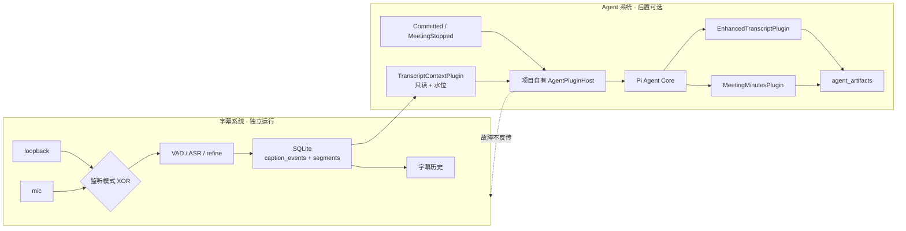

# Agent 插件架构调研与建议

> 状态：已接受设计，按 [ADR 0003](adr/0003-project-owned-agent-plugin-host.md) 在字幕 MVP 后进入 A1 实现
>
> 日期：2026-07-30
>
> 约束来源：[语义合同](semantic-contract.md) / [ADR 0002](adr/0002-separate-subtitle-and-agent-systems.md)

## 1. 结论

采用 **Pi Agent Core + 项目自有 AgentPluginHost + 第一方能力插件**，不要嵌入完整 `pi-coding-agent`，也不要把整个字幕系统变成 Pi 插件。

用户设想中的“语音插件”应精确拆成两部分：

- 字幕系统：独立产品内核，拥有互斥的 `loopback`/`mic` 采集、ASR、会话、SQLite 字幕事实和历史。它不依赖 Pi。
- 字幕上下文插件：Agent 侧的只读适配器，只把已经提交的文字按水位提供给 Pi。它不接触原始音频，也不控制 ASR。

总结功能可以是真正的 Agent 能力插件：它读取字幕上下文，运行有界 Agent Loop，生成会后结构化纪要，并把结果保存为独立 `agent_artifacts`。

这组模式可称为：

- **Microkernel / Plugin Architecture**：Agent Loop 是微内核，业务能力由插件贡献。
- **Ports and Adapters / Hexagonal Architecture**：插件通过窄端口访问字幕、模型和产物存储。
- **Event-driven integration**：字幕提交、会话停止等应用事件触发可靠任务。
- **Capability-based security**：插件只拿到它声明且被批准的能力。

## 2. 推荐拓扑



主依赖方向始终是 `Agent → 已提交字幕`。虚线不是调用关系，而是故障隔离约束。

## 3. 首版插件模型

### 3.1 插件分类

| 类型 | 职责 | 首版实例 |
|---|---|---|
| `context-provider` | 把产品事实转换为 Agent 可用上下文，只读 | `transcript-context` |
| `artifact-generator` | 使用 LLM/Agent Loop 生成版本化内容产物 | `enhanced-transcript`、`meeting-minutes` |
| `evaluator` | 校验产物结构、引用水位、空内容和质量下限 | 后续 `minutes-quality-gate` |

该分类借鉴 ElizaOS 的 providers/actions/evaluators/services，但不引入第二套 Agent runtime。持续音频采集不归为 Agent `service`，因为它必须在 Agent 完全关闭时仍成立。

### 3.2 概念清单

```json
{
  "id": "meeting-minutes",
  "version": "1.0.0",
  "apiVersion": "1",
  "kind": "artifact-generator",
  "activationEvents": ["onMeetingStopped", "onUserRequest"],
  "requires": ["transcript-context"],
  "permissions": ["transcript.read", "model.invoke", "artifact.write"],
  "contributes": ["artifact:meeting-minutes"],
  "failurePolicy": "isolate",
  "timeoutMs": 120000
}
```

权限采用白名单。未声明即不可用；首版不存在 `shell.execute`、`process.spawn`、`filesystem.write`、`network.fetch` 或 `external.write`。模型网络请求只能走宿主提供的 `ModelGateway`，内部产物只能走 `ArtifactWriter`。

### 3.3 插件上下文端口

插件只接触以下稳定能力：

- `TranscriptReader`：按 `sessionId + inputWatermark` 读取已经提交的当前正文。
- `ModelGateway`：由宿主管理 provider、凭据、超时、取消和用量。
- `ArtifactWriter`：只写版本化 `agent_artifacts`，不能写 `caption_events/segments`。
- `Clock`、`Logger`：可测试的时间与去敏日志。
- `AbortSignal`：用户取消、超时或关机时有界结束。

SQLite 文件、Electron renderer、音频帧、ASR worker、`safeStorage` 和任意系统 API 都不直接暴露给插件。

## 4. 确定性触发而非 LLM 自主调度

首版的应用流程应为：

1. 用户停止会话。
2. storage worker 完成有界 flush，得到该会话的完整提交水位与 digest。
3. 应用层创建幂等 `meeting-minutes` job。
4. PluginHost 激活字幕上下文插件与纪要插件。
5. Pi Agent Loop 只在该 job 的受控上下文和内容型工具内迭代。
6. 结构校验通过后写入独立纪要；失败只记录 job 状态，字幕和历史不受影响。

是否需要总结由产品事件决定，不交给 LLM 猜测。待办只作为纪要字段输出，不注册“发邮件、建日程、改文件”等工具。

增强文本独立保存，A2 首版只做“会后/用户主动触发的整场增强”。按 committed segment 滚动增强后置，避免延迟、成本和迟到 refined 纠正同时进入第一版。

## 5. 与 Pi 内部框架的具体冲突

### 5.1 原设计的想法与本次变化

原设计把整个 Agent 层先收敛成一个可替换的 `AgentRuntime` 适配器，Pi 只作为低层 Loop 候选；字幕通过 SQLite 提交水位单向供给 Agent，Agent 工具受白名单控制。这样设计是因为字幕 MVP、Pi/Electron 兼容性、可靠消费和产品功能都还未冻结，先保住字幕独立性，避免过早把存储与某个 Agent 框架锁死。

本次插件化不是推翻原设计，而是把 `AgentRuntime` 内部细分为：

```text
AgentRuntime（对产品保持稳定）
└─ AgentPluginHost（清单 / 权限 / 生命周期 / registry）
   ├─ PiAgentAdapter（Agent Core / Loop）
   ├─ TranscriptContextPlugin
   ├─ EnhancedTranscriptPlugin
   └─ MeetingMinutesPlugin
```

唯一需要纠正的是“把语音系统整体安插在 Pi 上”。如果照字面实现，字幕会依赖 Pi 的启动、会话切换、扩展重载和崩溃恢复，直接违反 ADR 0002。保留“插件体验”的办法，是把 Agent 需要的**字幕读取能力**做成插件，而不是把音频采集和 ASR 的所有权交给插件。

### 5.2 冲突与取舍表

| Pi 现状 | 与本项目的冲突 | 取舍 |
|---|---|---|
| `pi-agent-core` 是通用 Agent 状态/循环包，不是完整动态插件管理器 | 单独引入 core 不会自动得到发现、清单、权限、生命周期和产物注册 | 保留 core；由项目实现窄 PluginHost |
| 完整 extensions API 位于 `pi-coding-agent`，并带 TUI、命令、项目目录、编码工具和 JSONL 会话 | 本项目已有 Electron UI、SQLite 会话权威，也明确禁止 shell/read/write 外部操作 | 不嵌入 coding-agent；只参考其事件与扩展语义 |
| coding-agent 扩展随 `session_start/session_shutdown`、`/new`、`/resume`、`/fork`、`/reload` 重建 | 字幕监听生命周期由用户的 Start/Stop 决定，不能因 Agent 会话切换或重载中断 | 字幕系统在宿主外独立；插件只按 job 激活 |
| Pi 扩展官方明确提示会以用户完整系统权限执行任意代码 | 与“只生成内容”以及未来第三方生态的安全边界冲突 | 首版只静态注册受信任第一方插件，并以 capability facade 限权 |
| coding-agent 自带会话持久化和 append entry | 会制造与 SQLite `sessionId + watermark` 并列的第二权威 | Pi 消息状态只作一次 job 的运行态；产品事实和产物仍在 SQLite |
| Agent 的工具通常由模型选择调用，多个工具可能并行 | 会后纪要需要确定性触发、同一水位幂等，外部操作又被禁止 | 应用创建 job；每会话/水位串行，工具集只含内容型能力 |
| Pi Hook 支持观察与可变事件，但 Pi 自己的设计说明工具、命令和 provider 等仍是宿主 registry | 不能把 hook 当成完整插件框架 | PluginHost 持有 registry、来源元数据、错误策略和 cleanup；hook 只做循环内拦截/观察 |
| 当前包为 ESM，声明 Node `>=22.19.0`；本项目入口为 CommonJS | Electron utility process 的动态 import、Node 版本与 asar 打包仍有兼容风险 | A1 先做隔离探针，不在字幕 MVP 阶段安装依赖 |

调研时官方包版本为 `0.83.0`。Pi 官方材料：[`pi-agent-core` 包元数据](https://raw.githubusercontent.com/earendil-works/pi/main/packages/agent/package.json)、[`pi-coding-agent` 包元数据](https://raw.githubusercontent.com/earendil-works/pi/main/packages/coding-agent/package.json)、[扩展文档](https://github.com/earendil-works/pi/blob/main/packages/coding-agent/docs/extensions.md)、[Agent Harness Hooks 设计](https://github.com/earendil-works/pi/blob/main/packages/agent/docs/hooks.md)。

## 6. 方案取舍

| 方案 | 优点 | 主要代价 | 结论 |
|---|---|---|---|
| 完整嵌入 `pi-coding-agent` | 现成发现、热重载、命令和扩展 API | 编码/TUI/项目/JSONL 假设过重；完整系统权限；包与打包面更大 | 不选 |
| `pi-agent-core` + 项目自有 PluginHost | 保留 Pi Loop；边界、SQLite、Electron 生命周期和权限均可控 | 需要实现小型 registry/manifest/lifecycle/diagnostics | **已选** |
| Fork Pi 扩展 runner | API 最接近 Pi extensions | 上游合并负担；仍需删改 coding-agent 语义 | 暂不选 |
| 每项能力都做 MCP server | 进程隔离、跨语言 | 本地 IPC 和部署过重，不适合高频内部字幕事件 | 只考虑未来第三方集成 |
| 用 ElizaOS/Semantic Kernel 替换 Pi | 插件/函数模型成熟 | 引入第二套或替换既定 Agent runtime | 不选，只借概念 |

## 7. 可参考的优秀开源设计

| 项目 | 借鉴内容 | 不照搬的部分 |
|---|---|---|
| [Pi](https://github.com/earendil-works/pi) | Agent Loop、tool lifecycle、hooks、取消、扩展来源与 cleanup | coding CLI、TUI、JSONL 会话、默认文件/shell 工具和无限权扩展 |
| [ElizaOS](https://github.com/elizaOS/eliza) / [Plugin Reference](https://docs.elizaos.ai/plugins/reference) | provider/action/evaluator/service 分类、插件依赖与优先级 | 不把音频服务塞进 Agent，也不替换 Pi |
| [Semantic Kernel](https://github.com/microsoft/semantic-kernel) / [Plugin Docs](https://learn.microsoft.com/en-us/semantic-kernel/concepts/plugins/) | 为可调用函数写清名称、语义描述和参数 schema | 不引入其 Kernel 作为第二循环 |
| [VS Code](https://github.com/microsoft/vscode) / [Extension Host](https://code.visualstudio.com/api/advanced-topics/extension-host) / [Manifest](https://code.visualstudio.com/api/references/extension-manifest) | 未来第三方插件的 manifest、activation、运行位置、宿主隔离和信任模型 | 第一方 MVP 不做市场、热重载或多宿主 |

## 8. 联合测试边界

插件不能只写单元测试。A1/A2 至少要覆盖：

- `loopback` 和 `mic` 两条单路 fixture 分别完成“提交字幕 → 停止 → 字幕插件 → Pi Loop → 纪要插件 → SQLite 产物 → 历史 UI”。
- UI/config/runtime 三层都拒绝双路；停止换源后不串 `sessionId`。
- refined、重复 job、崩溃恢复和迟到结果不制造两个当前纪要。
- 插件异常、超时、取消、卸载、ModelGateway 断网时字幕仍可显示、落盘和查看。
- 越权请求（shell、任意文件写、任意网络、外部写）被宿主拒绝；内部 `agent_artifacts` 仍可控写入。
- 正常/崩溃/导出/迁移路径均无原始音频持久化。

对应旅程见 [J3、J4、J7、J12、J13](testing-strategy.md)。

## 9. 当前代码对齐审计

| 当前实现 | 对齐情况 | 后续实现缺口 |
|---|---|---|
| 设置页使用 `radiogroup` 单选并只经 preset IPC 原子切换 | 对齐 | 活动会话中控件禁用，主进程仍做权威拒绝 |
| 共享 listening-mode 契约、`ConfigStore` 与 `SessionCoordinator` 都要求完成 onboarding 后恰好一路且匹配 preset | 对齐 | 旧独立开关配置按有效 preset 迁移修复 |
| Fake/Realtime adapter、audio host、worker host/core 都拒绝长度不为 1 的来源数组 | 对齐 | `mic` 与 `loopback` 仅在不同会话/独立实机 smoke 中验证 |
| Runtime fixtures 为单路状态；J4 联合旅程验证 UI/config/runtime/SQLite 拒绝双路、活动期拒绝换源、停止后新会话隔离 | 对齐 | Agent 产物接入后需在同一 J4 继续扩展断言 |
| 默认产品旅程只把 final/refined 文字事实写入 SQLite，JSONL 仅迁移/导出；产品诊断、smoke 与 Gate runner 只输出无正文结构化指标 | 对齐 | J12 的打包版应用数据目录检查仍待 I4 |
| 项目尚未安装或实现 Pi/Agent runtime | 尚无框架锁定 | 先做 A1 ESM/Electron 探针，再实现 PluginHost；不影响当前字幕主线 |
