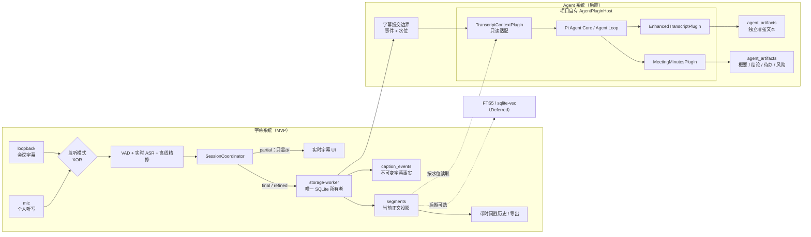

# 字幕系统持久化与 Agent 派生数据架构

> 状态：SQLite 字幕存储与 Agent 插件宿主语义已接受；DB0 开发态、DB1 原子/幂等及 Gateway/Recorder 恢复组合门禁已通过（2026-07-31）；默认产品切换、迁移、历史、退出接线及打包态资格尚未完成；向量检索 Deferred
>
> 决策依据：[ADR 0001](adr/0001-sqlite-authoritative-event-store.md) / [ADR 0002](adr/0002-separate-subtitle-and-agent-systems.md) / [ADR 0003](adr/0003-project-owned-agent-plugin-host.md)
>
> 规范语义：[`semantic-contract.md`](semantic-contract.md)

## 1. 架构名称与边界

整体可称为 **Local-first, Event-driven Meeting Intelligence Architecture**（本地优先、事件驱动的会议智能架构）。产品上由字幕系统与 Agent 系统组成，Agent 只消费字幕提交边界后的事实。其中使用的专业模式是：

- **Event-sourced transcript store**：字幕正文以不可变事件保存。
- **CQRS-lite / materialized projection**：写入事实，历史/UI/导出读取当前段落投影。
- **Committed event boundary**：只有持久化成功的 final/refined 才能进入 Agent 系统。
- **Transactional outbox / durable consumer cursor**：Agent 阶段用于可靠消费字幕事实，具体形态在 A1 探针后冻结。
- **Eventually consistent Agent workers**：增强文本和摘要允许稍后完成，但必须可重放、可去重。
- **Microkernel / Plugin Architecture**：Pi Agent 核心负责循环，项目自有插件宿主负责能力注册、权限、生命周期和故障隔离。
- **Ports and Adapters**：字幕上下文插件只经稳定端口读取已提交字幕，Agent 插件不接触音频/ASR 或字幕写库。
- **Capability-based design**：插件只获得声明过的窄能力，首版没有外部副作用权限。
- **Hybrid retrieval（Deferred）**：FTS5 与 `sqlite-vec` 的混合检索只是后期可选项。
- **Vertical-slice integration testing**：CI 围绕用户旅程跨模块验证，而不是只测类或函数。

本设计不承诺说话人分离；一次会话只运行 `loopback` 或 `mic`；产品现在及未来都不保存原始音频；不让 Agent 产物或向量索引成为字幕事实来源，也不让云端 AI 成为本地字幕的前置依赖。

## 2. 目标拓扑

### 2.1 进程所有权

| 组件 | 所有权 | 禁止事项 |
|---|---|---|
| `SessionCoordinator` | 校验会话与字幕顺序，发布运行状态，把字幕事实交给 storage worker | 不执行 SQL，不等待 Agent 才广播字幕 |
| `storage-worker` | 唯一写连接、schema migration、字幕事务、投影和历史查询 | 不采集音频、不调用 LLM、不在 Electron 主事件循环执行同步数据库工作 |
| `AgentRuntime` / `AgentPluginHost`（A1） | 管理第一方插件、权限、触发、取消和故障隔离，调用 Pi 低层 Agent Loop，提交派生产物 | 不直接改字幕事件，不加载完整 coding-agent，不启用 shell/进程/任意文件写/外部写操作 |
| `TranscriptContextPlugin`（A1） | 按 `sessionId + inputWatermark` 只读已提交字幕并构造 Agent 上下文 | 不启动采集/ASR，不控制字幕会话，不持有字幕数据库写连接 |
| `embedding worker`（Deferred） | 未来对指定正文修订生成 embedding | 不在字幕 MVP 或首版摘要中创建 |
| renderer | 展示快照、字幕、历史和 Agent 派生产物 | 不访问数据库文件、不加载扩展、不自行折叠另一份权威正文 |

SQLite 驱动放在 storage worker 内的适配器后。当前候选为 Electron/Node 内置 `node:sqlite`：Electron 43 utility process 的开发态探针已验证驱动加载、WAL、migration、事务隔离/回滚与重开恢复；它没有外置 native addon 或 `asarUnpack` 需求。真实 ASAR/NSIS 路径仍必须在 B5/I4 复跑，通过前 DB0 总门禁保持 partial。驱动可以替换，本文的数据语义不能随驱动改变。`sqlite-vec` 扩展加载不属于 DB0。

## 3. 数据权威与逻辑表

数据库建议位于 `app.getPath('userData')/data/speech-agent.sqlite3`。文件名和目录属于实现配置，不能由 renderer 提供任意路径。

| 逻辑表 | 类型 | 关键字段 | 规范语义 |
|---|---|---|---|
| `schema_migrations` | 运维事实 | `version, checksum, applied_at` | 每次迁移只执行一次；checksum 不匹配必须 fail closed。 |
| `sessions` | 权威会话数据 | `session_id, mode, source_id, started_at, ended_at, state` | 定义会话隔离边界；`source_id` 只能是 `loopback` 或 `mic` 且会话期间不可变；结束会话不删除其历史。 |
| `caption_events` | **字幕权威不可变事实** | `event_order, event_id, session_id, source_id, segment_id, sequence, revision, kind, t0_ms, t1_ms, text, created_at` | 字幕 MVP 只持久化 `final/refined`；`event_id` 与 `(session_id, source_id, sequence)` 唯一，用于幂等。已提交行不得原地改写正文。 |
| `segments` | 字幕物化投影 | `id, session_id, source_id, segment_id, text, text_revision, t0_ms, t1_ms, first_event_order, updated_event_order` | 每段的当前权威正文；仅更高有效修订可替换，历史/UI/导出从这里读取。可由事件重建。 |
| `agent_artifacts`（A1/A2） | 版本化派生产物 | `artifact_id, session_id, plugin_id, type, content_json, input_through_event_order, input_digest, provider, model, created_at` | 增强文本、翻译或会后纪要声明插件、类型、覆盖水位和输入 digest；不能伪装成字幕正文。纪要结构至少包含概要、结论、待办、风险。字段在 A1 探针后冻结。 |
| `agent_jobs` / consumer cursor（A1） | 可靠消费状态 | 待 A1 探针冻结 | 必须能按字幕提交水位去重、恢复和取消；具体采用事务 outbox 还是 durable cursor 尚未决定。 |
| `segments_fts`（可选） | **可重建索引** | `rowid -> segments.id, text` | 只有历史关键字搜索进入范围时才创建；不阻断 SQLite 历史。 |
| `segment_embedding_state`（Deferred） | 派生版本元数据 | `segment_id, text_revision, model_id, dimensions, content_hash, indexed_at` | X1 前不创建。启用后只有 revision、模型和内容哈希都匹配当前正文时才可检索。 |
| `segment_vectors`（Deferred） | **可重建索引** | `rowid -> segment_id, embedding` | X1 前不创建；启用后不得混放不同维度。 |
| `legacy_imports` | 迁移审计 | `source_path, source_sha256, imported_at, event_count, segment_count, result` | 保证同一 JSONL 不重复导入，并可核对迁移结果；其中 `event_count` 只记实际导入的 `final/refined` 字幕事实，源文件总记录数、translated/partial 与损坏行计数只出现在结构化迁移报告。 |

`event_order` 是数据库提交顺序，不取代 `sequence/revision` 的有效性判断；统一时间线展示仍按会话时间、来源与稳定的 tie-break 规则生成。

## 4. 写入与派生规则

### 4.1 字幕事务

每条持久 CaptionEvent 必须完成一个短事务：

1. 校验 schema、会话、来源、`sequence/revision` 和 event idempotency。
2. 以 `INSERT ... ON CONFLICT DO NOTHING` 语义追加 `caption_events`；重复事件返回“已处理”，不能再次触发副作用。
3. 只有有效更高修订才更新 `segments`。
4. 提交成功后才向历史订阅者发布持久化确认；事务失败不伪装成功。
5. Agent 系统上线时，可靠消费标记必须与字幕提交边界保持原子或可证明不丢；Agent job 创建失败不能回滚已经成功的字幕事实，也不能阻塞实时显示。

`partial` 继续走实时 UI 通道，不进入数据库、Agent 上下文或任何索引。

### 4.2 Agent 派生产物水位（A1/A2）

- 插件输入必须把 `caption_events.event_order <= input_through_event_order` 折叠成该水位时的正文，或使用 outbox 中不可变的段落修订清单；不得在稍后执行时直接读取已经超前的 `segments` 当前行。partial 永不进入输入。
- 同一段 refined 产生新的事件边界；后续摘要必须看到新正文，旧 final 不得重复计入。
- 增强文本和纪要结果同时保存输入水位、输入 digest、provider、model 与 `plugin_id`；UI 必须与权威原文分层显示。
- job 的 dedupe key 至少包含 `session_id + plugin_id + artifact_kind + input_watermark + input_digest`。
- pause/resume、renderer reload 或 worker replacement 不创建新摘要会话；`session_id` 变化才创建新边界。
- AI 超时、限流、断网或凭据失效只改变 Agent capability 与 job 状态，本地字幕、持久化和历史继续。
- 首版会后纪要由 `MeetingStopped` 在完整提交水位确定后触发；插件不能自行监听原始音频，也不能由 LLM 自主执行外部待办。
- 插件只通过 `TranscriptReader`、`ModelGateway`、`ArtifactWriter`、`Clock` 和 `Logger` 等显式端口工作。对模型 provider 的网络访问由 `ModelGateway` 统一代理；插件本身没有任意网络、文件、shell 或进程能力。

### 4.3 Embedding 与语义检索（Deferred）

本节仅保留后期约束，不进入当前 schema、依赖、DB0 或字幕/Agent 首版验收：

- embedding 输入是当前正文及其 `text_revision/content_hash`。结果回写时再次比较；已经过期的结果直接丢弃或登记为 superseded。
- `sqlite-vec` 扩展版本、embedding 模型 id、维度和归一化方式必须随索引版本记录。任一项变化均创建新索引代际并重建，不能混查。
- 默认混合检索先按 `session_id/source_id/time range` 过滤，再分别取得 FTS5 与向量候选，最后用可测试的 rank fusion 合并；权重属于产品配置，不能改变事实排序规则。
- 扩展缺失、加载失败或索引重建中时，能力降级为 FTS5；FTS5 也不可用时仍可按时间读取历史。降级必须可见，不能让搜索返回静默不完整结果。
- FTS 和向量均可从 `segments` 重建；删除索引不得损伤会话正文。

## 5. SQLite 运行规则

- 使用 WAL 以允许读写并发，但全应用仍只有一个写者；设置 `busy_timeout` 并记录锁等待指标。
- 事务只包含数据库工作，禁止在事务中执行网络请求、模型推理或等待 renderer。
- 每个 storage command 都带 `requestId`，写命令还带幂等键；worker 重启后调用方可以安全重试。
- schema migration 在无活动会话时执行；失败保留原库并阻止使用半迁移 schema。
- 定期 checkpoint 由 storage worker 控制，退出时做有界 flush；不能因等待 Agent 无限阻塞退出。
- API Key 继续由 `safeStorage` 单独保存，不进入字幕 SQLite、日志或字幕事件。
- SQLite schema 不包含音频 BLOB、录音路径或录音恢复表；临时 PCM 不进入数据库、日志、Agent 上下文、导出或诊断产物。测试只可读取来源明确的静态合成语料，不得把现场采集音频写盘。
- X1 未来启用 `sqlite-vec` 时，只能从固定、随应用发布且经哈希校验的路径加载；renderer 和用户可写目录不能指定任意扩展。

## 6. JSONL 迁移

B3.1 JSONL 是当前已实现基线；B3.3 迁移通过前，不得把 SQLite 写成已实现。迁移步骤：

1. 在没有活动会话时创建数据库与 schema，先保留原 JSONL 不动。
2. 逐文件解析并按现有 `segmentId + revision` 规则导入 `final/refined`；坏尾行继续容忍并记录，坏中间行要求显式报告。遗留 `translated` 只计入迁移报告并保留原 JSONL，不导入字幕 `caption_events`；未来由 Agent 迁移进入独立派生表。
3. 以文件 SHA256、原文事件数、折叠段数、原文当前正文 digest 和 txt/md/srt **原文导出** digest 做前后核对；不要求旧双语导出与新字幕原文导出逐字节相等。
4. 重跑导入必须命中 `legacy_imports` 幂等记录，不增加字幕事件、segment 或迁移副作用。
5. 全部核对通过后，下一次会话只写 SQLite；旧 JSONL 保留为只读恢复材料，不再双写。
6. 回滚只能切回迁移前备份或只读旧格式，不能合并两个写入分支。

## 7. 强制验收门禁

| Gate | 必须证明 | 对应旅程 |
|---|---|---|
| **DB0 运行资格** | Electron 43 utility process 可加载选定 SQLite 驱动，WAL、迁移与开发版/asar 打包路径均通过 | J10 / I4 |
| **DB1 原子与幂等** | 字幕事件与 segment 投影同成同败；重复、乱序、迟到事件不回滚正文或制造重复历史 | J1 / J2 / J6 |
| **DB2 迁移一致** | JSONL 导入可重跑，当前正文与 txt/md/srt 导出 digest 一致，迁移中断可恢复 | J10 |
| **DB3 Agent 联动（A1/A2）** | 两种单路来源分别验证；refine、暂停恢复、worker/插件崩溃和 AI 失败均满足输入水位、权限与隔离规则 | J3–J7 / J13 |
| **DB4 向量索引（Deferred）** | X1 启用后，refined 使旧向量立即不可服务；索引可重建；扩展不可用时 history 继续 | J11 |
| **DB5 长稳与发布** | 两小时数千段下数据库大小、WAL、内存和历史查询延迟有界；干净 Win11 打包版可迁移并退出 | J8 / J9 |
| **DB6 无音频持久化** | schema、应用数据目录、日志、迁移、导出和 Agent 输入均无原始音频或音频路径 | J12 / I4 |

任何 gate 只有局部测试时，只能标记“实现完成 / 尚未验收”。

### 7.1 当前 DB0 证据

- 开发态报告：[`validation/db0-sqlite-development-results.json`](validation/db0-sqlite-development-results.json)
- 已通过：Electron 43.2.0 utility process、内置 SQLite 3.53.1、WAL、`busy_timeout`、checksum migration、双连接提交可见性、会话来源不可变、事务回滚、事件/投影同事务提交、事件不可变触发器、checkpoint、重开与 `integrity_check`。
- 隐私结构检查：仅有字幕/会话/迁移表，无 BLOB、音频或录音列；没有 Agent、FTS、vector 表。
- 尚未通过：真实 ASAR/NSIS 打包路径，因此 DB0 总门禁为 **partial**，不能写成验收完成。

### 7.2 当前 DB1 / DB6 局部证据

- DB1 报告：[`validation/db1-storage-results.json`](validation/db1-storage-results.json)
- Gateway/Coordinator 报告：[`validation/storage-gateway-results.json`](validation/storage-gateway-results.json)
- 真实组合：Electron main 使用生产 `StorageWorkerHost`，经 utility process 的 `WorkerService` 串行调用真实 `SqliteSubtitleStore` 和文件 SQLite；loopback/mic 分开建会话并重开查询。
- DB1 已验证：业务幂等键不依赖 `requestId`；同键同载荷去重，同键异载荷冲突；高 revision 更新投影，迟到低 revision 只保留事实；ghost refined、partial、translated、跨源/关闭后新事件均 fail closed；事件插入后或投影后故障会整事务回滚，commit 后丢回复再提交只保留一份事实。
- Gateway 组合已验证：`starting` 先等 open ACK 才启动采集，final/refined 先进入持久化 FIFO 再广播 UI，close ACK 前保持 `stopping`；worker 空闲退出、提交前退出及 COMMIT 后 ACK 丢失均在旧 generation 完全退出后以同一载荷恢复，事实/投影不重复；pause/resume 保持同一会话，loopback/mic 顺序会话不串源，translated 不进入字幕事实。
- DB6 局部已验证：schema 无 BLOB/音频列，RPC 拒绝 `audioPath/samples/sql` 等额外字段且错误不回显正文/路径；Gateway 正常/故障组合的隔离 userData 无 JSONL 双写和音频产物。完整 DB6 仍需默认产品切换后的迁移、导出、`before-quit`、应用目录与 I4 检查。
- 尚未表示：SQLite 已成为默认产品权威、JSONL 已迁移、历史 UI 或产品 `before-quit` 已完成，或打包态已通过。

### 7.3 当前 DB2 实现证据

- 实现/范围报告：[`validation/db2-jsonl-migration.md`](validation/db2-jsonl-migration.md)
- 确定性 J10 联合 CI 使用生产 `JsonlSqliteMigrator、StorageGateway、WorkerService、SqliteSubtitleStore` 和真实临时文件 SQLite；只替代 Electron utility-process 进程边界。
- 已覆盖：逐文件原子事务；第二文件中断时不影响已提交第一文件、本文件无半导入；恢复后以同一队首和 SHA-256 幂等记录重放；SHA 与解析共用一份不可变字节快照；原文投影、txt/md/srt digest 一致；不可无损表达的亚毫秒时间 fail closed；缺失 close 记为 interrupted；坏中间行、截断尾、partial 与 translated 只计入无路径报告。
- 迁移 RPC 只接受已解析的 `final/refined` 白名单载荷与文件名/SHA，拒绝 SQL、绝对路径、音频字段和 translated 字幕事实；原 JSONL 不改写。
- 状态是「实现完成/尚未验收」：真实 Electron utility process 还未执行 import 操作，`main.js` 也未在冷启动调用迁移；因此不得声称 DB2/J10 产品门禁已通过或 SQLite 已切换权威。
