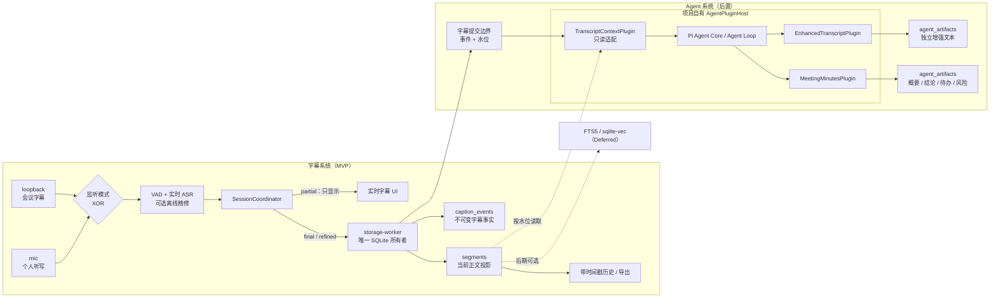

# 字幕系统持久化与 Agent 派生数据架构

> 状态：SQLite 字幕存储与 Agent 插件宿主语义已决定；DB0/DB1、Gateway 恢复、SQLite-only 生命周期、历史/导出、DB2/J10 与 J15b/J15c 文本版本结果已达到确定性联合验收完成（2026-08-02）。packaged Electron 已有旧 JSONL 首启迁移、同 `userData` 二次启动幂等、跨会话版本重置以及精修故障/覆盖复读证据；I3 非音频 3,600 段资源预资格为 `pass/partial`。真实两小时音频与干净机 I4 尚未达到实机验收完成；向量检索 Deferred
>
> 决策依据：[ADR 0001](adr/0001-sqlite-authoritative-event-store.md) / [ADR 0002](adr/0002-separate-subtitle-and-agent-systems.md) / [ADR 0003](adr/0003-project-owned-agent-plugin-host.md) / [ADR 0004](adr/0004-immutable-first-pass-and-optional-refinement.md) / [ADR 0008](adr/0008-terminal-session-agent-job-reconciliation.md)
>
> J15b/J15c 对齐提示：为避免破坏既有 SQLite，schema v2 仍以 append-only 兼容事件日志和 `segments` 当前投影保存 `final/refined`；读取契约用 `first_event_order` 取回不可变首次 `final`，并把精修稿作为独立 `refinedText` 暴露。历史 renderer 的版本选择按会话作用：同会话翻页保留选择，切换会话恢复原始版。`refinement_session_results` 独立保存会话开始时冻结的精修启用值和稳定故障事实，整场 `N/M` 从权威行派生；零精修、不完整精修、空会话与旧会话均有显式语义。v2 是追加 migration，既有 v1 SQL/checksum 保持逐字节不变；既有 SQLite 会话和后续导入的旧 JSONL 只能标记 `not_recorded`，不得反推为无故障。
>
> 规范语义：[`semantic-contract.md`](semantic-contract.md)

## 1. 架构名称与边界

整体可称为 **Local-first, Event-driven Meeting Intelligence Architecture**（本地优先、事件驱动的会议智能架构）。产品上由字幕系统与 Agent 系统组成，Agent 只消费字幕提交边界后的事实。其中使用的专业模式是：

- **Event-sourced transcript store**：字幕正文以不可变事件保存。
- **CQRS-lite / materialized projection**：写入事实，历史/UI/导出读取当前段落投影。
- **Committed event boundary**：只有持久化成功的 final/refined 才能进入 Agent 系统。
- **Terminal-session durable reconciliation**：按 ADR 0008 从终态会话及完整输入水位补建缺失后台 Agent 任务，不把 Agent outbox 加入字幕事实事务。
- **Eventually consistent Agent workers**：增强文本和摘要允许稍后完成，但必须可重放、可去重。
- **Microkernel / Plugin Architecture**：Pi Agent 核心负责循环，项目自有插件宿主负责能力注册、权限、生命周期和故障隔离。
- **Ports and Adapters**：字幕上下文插件只经稳定端口读取已提交字幕，Agent 插件不接触音频/ASR 或字幕写库。
- **Capability-based design**：插件只获得声明过的窄能力，首版没有外部副作用权限。
- **Hybrid retrieval（Deferred）**：FTS5 与 `sqlite-vec` 的混合检索只是后期可选项。
- **Vertical-slice integration testing**：CI 围绕用户旅程跨模块验证，而不是只测类或函数。

本设计不承诺说话人分离；一次会话只运行 `loopback` 或 `mic`；产品现在及未来都不保存原始音频；不让 Agent 产物或向量索引成为字幕事实来源，也不让云端 Agent 模型 provider 成为本地字幕的前置依赖。

## 2. 目标拓扑

### 2.1 进程所有权

| 组件 | 所有权 | 禁止事项 |
|---|---|---|
| `SessionCoordinator` | 校验会话与字幕顺序，发布运行状态，把字幕事实交给 storage worker | 不执行 SQL，不等待 Agent 才广播字幕 |
| `storage-worker` | 唯一写连接、schema migration、字幕事务、投影和历史查询 | 不采集音频、不调用 LLM、不在 Electron 主事件循环执行同步数据库工作 |
| `AgentRuntime` / `AgentPluginHost`（A1） | 管理第一方插件、权限、触发、取消和故障隔离，调用 Pi 低层 Agent Loop，提交派生产物 | 不直接改字幕事件，不加载完整 coding-agent，不启用 shell/进程/任意文件写/外部写操作 |
| `TranscriptContextPlugin`（A1） | 按 `sessionId + inputWatermark + transcriptVersion + digest` 只读已提交的明确正文版本并构造 Agent 上下文 | 不启动采集/ASR，不控制字幕会话，不持有字幕数据库写连接 |
| `embedding worker`（Deferred） | 未来对指定正文修订生成 embedding | 不在字幕 MVP 或首版摘要中创建 |
| renderer | 展示快照、字幕、历史和 Agent 派生产物 | 不访问数据库文件、不加载扩展、不自行折叠另一份权威正文 |

SQLite 驱动放在 storage worker 内的适配器后。当前选择 Electron/Node 内置 `node:sqlite`：Electron 43 utility process 的开发态探针已验证驱动加载、WAL、migration、事务隔离/回滚与重开恢复；B5 又从真实 ASAR 内的 storage utility 完成同一 17 项资格并 exact exit 0，同时由 production storage utility 写入/读取 packaged 产品会话。它没有外置 native addon 或 `asarUnpack` 需求。DB0 的开发态与打包态确定性资格已通过；精确 NSIS 干净机发布仍归 I4，不反向改变驱动选择。`sqlite-vec` 扩展加载不属于 DB0。

## 3. 数据权威与逻辑表

数据库建议位于 `app.getPath('userData')/data/speech-agent.sqlite3`。文件名和目录属于实现配置，不能由 renderer 提供任意路径。

| 逻辑表 | 类型 | 关键字段 | 规范语义 |
|---|---|---|---|
| `schema_migrations` | 运维事实 | `version, checksum, applied_at` | 每次迁移只执行一次；checksum 不匹配必须 fail closed。 |
| `sessions` | 权威会话数据 | `session_id, mode, source_id, started_at, ended_at, state` | 定义会话隔离边界；`source_id` 只能是 `loopback` 或 `mic` 且会话期间不可变；结束会话不删除其历史。 |
| `caption_events` | **追加事件日志（兼容存放原始事实与精修版本）** | `event_order, event_id, session_id, source_id, segment_id, sequence, revision, kind, t0_ms, t1_ms, text, created_at` | 当前零迁移 schema 继续持久化 `final/refined`；首次 `final` 是唯一权威原始转写，`refined` 行只是独立精修稿的兼容存储表示，不构成新的原始字幕事实。`event_id` 与 `(session_id, source_id, sequence)` 唯一，已提交行不得原地改写正文。 |
| `segments` | 字幕可重建兼容投影与版本锚点 | `id, session_id, source_id, segment_id, text, text_revision, t0_ms, t1_ms, first_event_order, updated_event_order` | `first_event_order` 恒指向首次 `final`；`text` 可随更高有效 revision 更新，但不再决定默认显示正文。对外读取必须联结首次事件并分别返回原始 `text` 与可选 `refinedText`；`refinedText=null` 表示该段没有精修稿，是整场精修覆盖判断的有效状态。关闭全局精修偏好不得修改或删除任何既有行。`0 < N < M` 时 UI 与导出回退必须统一标记 `[原始版回退]`；`N = 0` 时不得提供精修视图或精修导出。原始版导出不得因此改变。历史/UI/导出不得直接把兼容投影当作权威原始转写。 |
| `refinement_session_results`（schema v2） | 会话级精修运行事实 | `session_id, result_status, refinement_enabled, fault_code, fault_stage, fault_at_ms` | 每个会话至多一行。`result_status` 只允许 `known/not_recorded`：新会话写 `known`；既有 SQLite 会话与旧 JSONL 导入写 `not_recorded`，此时 `refinement_enabled` 和故障字段为空。`known` 行的 `refinement_enabled` 是会话开始时冻结的全局偏好快照；`fault_code` 可空且只允许 `REFINE_WORKER_START_FAILED`、`REFINE_WORKER_EXITED`、`REFINE_DECODE_FAILED`、`REFINE_INVALID_RESPONSE`、`REFINE_INTERNAL_FAILURE`，`fault_at_ms` 是会话内相对时点。故障确认后必须立即持久化，关闭会话、应用重启或最终 `N=M` 都不得清除。该表不保存正文、音频、路径、原始 Error/stack 或可变覆盖计数；`N/M` 继续从权威字幕行派生。 |
| `recognition_session_configs`（J20） | 会话冻结配置与降级事实 | `session_id, strategy, primary_provider, fallback_provider, term_set_version, term_set_digest, fallback_code, fallback_at_ms` | 每个会话固定记录权威识别策略、非敏感 provider ID 和确认关键词集合版本。降级只记录稳定原因与会话内相对时点；不得保存凭据、PCM、设备名或原始错误。 |
| `recognition_terms` / `recognition_term_sets` / `recognition_term_set_members`（J20） | 用户确认词汇与版本化集合 | `term_id, scope_id, canonical_text, aliases_json, proposal_origin, source_memory_identity_hash, revision, active`; `term_set_version, digest, created_at`; `term_set_version, term_id, term_revision, canonical_text, aliases_json, matched_aliases_json` | 只有用户明确确认的术语、实体名和别名进入集合；自动记忆只能留下待确认来源身份，不能伪装为手工确认。开始会话时把少量全局项与用户选择的主题/项目范围物化成不可变成员清单，成员必须匹配确认时的 revision、正文与别名快照，会话以同一行绑定集合版本与 digest。写作偏好和摘要偏好不得进入。 |
| `agent_artifacts`（A1/A2） | 版本化派生产物 | `artifact_id, run_id, session_id, plugin_id, type, content_json, content_digest, transcript_version, input_through_event_order, input_digest, recipe_version, provider, model, supersedes_artifact_id, created_at` | `(run_id, plugin_id, type)` 唯一。`ArtifactWriter` 在 Schema 校验后计算 `content_digest`；冲突时必须同时匹配 content digest、session、正文版本、水位、input digest、recipe、provider 和 model 才返回已有产物，任一不同时以 `AGENT_OUTPUT_INVALID` fail closed。用户主动重新运行使用新 `run_id`，可以产生同输入的新版本。 |
| `agent_jobs`（A1） | 可靠消费状态 | `job_id, run_id, dedupe_key, client_idempotency_key, request_digest, session_id, plugin_id, artifact_kind, transcript_version, input_watermark, input_digest, recipe_version, provider, provider_kind, model, state, attempt_count, max_attempts, next_attempt_at, lease_owner, lease_expires_at, lease_renewed_from_expires_at, cancel_requested_at, error_code, result_digest, result_summary_json, requested_by, created_at, updated_at` | `job_id`、`run_id`、`dedupe_key` 分别唯一，非空 `client_idempotency_key` 也唯一。自动任务的 client key 为空并使用完整输入身份的确定性 `dedupe_key`；用户主动重新运行使用新 `run_id/dedupe_key`，同一 client key 只有 `request_digest` 完全相同时才返回已有任务，不同时以 `AGENT_REQUEST_INVALID` fail closed。`provider/provider_kind/model` 是任务创建时冻结的非敏感 Agent 模型 provider 快照；`provider_kind` 只允许 `cloud/local`，供领取时执行本地资源让行。`lease_renewed_from_expires_at` 只保存最近一次成功续租的旧绝对到期点，用来区分同请求重放与同 owner 陈旧租约。只有 `succeeded` 可持有 storage worker 计算的 `result_digest/result_summary_json`，用于结果回复丢失后的幂等重放；摘要只含标识与计数，不含字幕正文。过期租约恢复时沿用同一 `run_id`；Agent job 创建失败不回滚字幕事实。 |
| `agent_claim_receipts`（A4） | 领取响应幂等事实 | `claim_idempotency_key, request_digest, run_id, lease_owner, lease_expires_at, created_at` | 领取与 receipt 在同一事务提交；同 key/同 digest 重放只返回原 `run_id` 的同一租约或空结果，不得顺序领取下一任务。receipt 不级联删除，因而会话删除后的迟到重放仍只能返回空结果。 |
| `session_deletion_tombstones`（A3） | 会话删除边界 | `session_id, deletion_idempotency_key, request_digest, deleted_*_count, deleted_at` | 在删除字幕与 Agent 关联事实前写入；同 key/同 digest 重放返回原计数，不再次清理其它会话。已删除 `session_id` 不得重建，迟到提交与后续对账 fail closed。只记录标识、计数与时间，不记录正文、设备名或路径。 |
| `memory_scopes`（J21） | 个人记忆范围 | `scope_id, kind, canonical_key, label, session_id, origin, lifecycle, created_at, updated_at` | `kind` 只允许全局、会话、主题、项目；会话范围必须绑定同一 `session_id`，其它范围不得伪装成会话范围。模型可提出主题/项目范围；名称不稳定时保留会话范围，范围合并必须由用户确认。 |
| `memory_items`（J21） | 当前个人记忆投影 | `memory_id, scope_id, kind, semantic_key, content_json, origin, confidence_band, salience_band, lifecycle, current_revision_id, created_at, updated_at` | 每行表达一个原子信息；`origin` 区分明确内容与自动推断。明确内容不能被自动推断覆盖；失效、冲突和被替代条目退出当前检索但不改写来源历史。 |
| `memory_revisions`（J21） | 个人记忆追加变更 | `revision_id, memory_id, operation, content_json, previous_revision_id, run_id, created_at` | 创建、合并、替代、失效和用户修正都追加记录；当前投影只指向一个 revision。删除正文后只允许留下不含正文的审计或抑制事实。 |
| `memory_evidence`（J21） | 个人记忆来源关系 | `evidence_id, run_id, memory_id, session_id, transcript_version, input_watermark, from_event_order, through_event_order, input_digest, plugin_id, recipe_version, provider, model, created_at` | 自动记忆必须至少有一个可回到权威原始转写事件范围的来源；只保存引用和 digest，不复制正文。`run_id/session/input/provider` 复合外键必须完整匹配同一 `memory-extraction` job，`input_watermark` 记录该 job 的完整输入水位，证据范围仍可指向其中的子区间；重复事实增加来源证据，不重复创建当前条目。 |
| `memory_suppressions`（J21） | 删除抑制事实 | `identity_hash, scope_id, source_digest, created_at` | 用户明确删除记忆后阻止同一旧来源重新生成相同条目；不保存被删除正文。新的会话证据可以重新提出候选。 |
| `agent_debug_threads` / `agent_debug_messages`（J22） | 本地调试聊天 | `thread_id, selected_session_id, selected_input_watermark, selected_transcript_version, selected_input_digest, created_at`; `message_id, thread_id, role, content_json, provider, model, created_at` | 调试聊天独立于字幕会话、Agent 产物和个人记忆；选择上下文时冻结完整输入身份，只保存在本地，可清空，永不自动进入记忆或确认关键词。内部思维过程不得写入。 |
| `segments_fts`（可选） | **可重建索引** | `rowid -> segments.id, text` | 只有历史关键字搜索进入范围时才创建；不阻断 SQLite 历史。 |
| `segment_embedding_state`（Deferred） | 派生版本元数据 | `segment_id, text_revision, model_id, dimensions, content_hash, indexed_at` | X1 前不创建。启用后只有 revision、模型和内容哈希都匹配当前正文时才可检索。 |
| `segment_vectors`（Deferred） | **可重建索引** | `rowid -> segment_id, embedding` | X1 前不创建；启用后不得混放不同维度。 |
| `legacy_imports` | 迁移审计 | `source_path, source_sha256, imported_at, event_count, segment_count, result` | 保证同一 JSONL 不重复导入，并可核对迁移结果；其中 `event_count` 只记实际导入的 `final/refined` 兼容事件，源文件总记录数、translated/partial 与损坏行计数只出现在结构化迁移报告。 |

`event_order` 是数据库提交顺序，不取代 `sequence/revision` 的有效性判断；统一时间线展示仍按会话时间、来源与稳定的 tie-break 规则生成。

Agent digest 统一使用 RFC 8785 JSON Canonicalization Scheme 的 UTF-8 字节并计算 SHA-256 小写十六进制。storage worker 从按 `event_order` 排序的选定正文事件与 `session_id/transcript_version/input_watermark` 计算 `input_digest`；调用方传入值只作为 expected digest，重读时必须复算比较。`AgentPluginHost` 从不可变任务字段计算自动 `dedupe_key` 和人工 `request_digest`；`ArtifactWriter` 从 Schema 校验后的 `content_json` 计算 `content_digest`。renderer、插件和模型返回的 digest 都不是权威计算结果。

正式 v3 还以数据库约束闭合跨表身份：产物必须完整匹配对应 job 的 `run_id/session/plugin/type/input/recipe/provider/model`；个人记忆来源必须完整匹配同一 `memory-extraction` job 的 `run_id/session/input/recipe/provider/model`；当前个人记忆 revision 必须属于同一 `memory_id`，previous revision 也不得跨条目；记忆 revision 的 `run_id` 必须来自记忆提取任务；确认关键词成员必须属于既有集合并匹配术语 revision、正文与别名快照；识别会话配置中的集合 version/digest 必须来自同一集合行。

自动对账先以 `sessions.state IN ('closed', 'interrupted') AND ended_at IS NOT NULL` 选择终态会话，再由 storage worker 计算 Agent 处理资格。只有至少一条首次稳定转写、`ended_at >= automaticProcessingSince`、Agent 总开关开启且 Agent 模型 provider 配置/云端披露/凭据或本地模型就绪条件全部满足时才返回 `ready` 并补建纪要与增强文本任务；个人记忆任务还要求个人记忆开启且 `ended_at >= memoryProcessingSince`。自动请求遇到更早终态会话返回 `outside_automatic_window`；只早于个人记忆自动处理边界时仍可创建另外两项任务但省略记忆任务。用户从历史明确请求时忽略两个时间边界，但仍须使用当前输入身份并满足其它资格，明确请求记忆任务时个人记忆必须开启。`input_watermark` 是该输入快照消费到的最大 `caption_events.event_order`，写入产物时原值进入 `input_through_event_order`；正文版本不同即使水位相同也必须得到不同 input digest 与任务身份。`transcript_version='refined'` 只允许整场精修覆盖 `N=M`；不完整精修混合显示正文不形成 Agent 输入版本。

终态历史列表或详情 envelope 必须返回会话级 `segmentCount=M`、`refinedSegmentCount=N`、`refinementResultStatus`、可空的 `refinementEnabled` 与 `refinementFaultCode`。`M` 从全部权威首次 `final` 锚点聚合，包含停止收尾、队列限界或精修故障未覆盖段；`N` 从独立精修稿聚合，`partial` 不进入任一计数。这两个计数可由有界 `COUNT` 查询派生，不要求增加可变计数列；它们不能从当前最多 50 条的详情页计算。HistoryService、工具条会话状态通知、renderer 和 exporter 必须使用同一组覆盖元数据与独立故障事实，决定完整精修、`refined-incomplete`、零精修、空会话和故障文案，避免各自推断。该通知只报告处理状态，不概括或改写字幕内容。`M=0` 且无故障时不返回 `0/0` 展示状态；有故障时显示“精修进程异常结束；本会话未产生可精修的已定稿字幕”。`not_recorded` 只在精修详情显示“未记录精修运行状态”，不进入普通历史列表。MVP 不增加逐段技术故障原因或回退筛选字段；`N < M` 不能证明 worker 崩溃，`N = M` 也不能清除已确认故障。后者必须明确显示“精修进程异常结束，但本次已生成 N/N 段精修稿”。

## 4. 写入与派生规则

### 4.1 字幕事务

每条持久 CaptionEvent 必须完成一个短事务：

1. 校验 schema、会话、来源、`sequence/revision` 和 event idempotency。
2. 以 `INSERT ... ON CONFLICT DO NOTHING` 语义追加 `caption_events`；重复事件返回“已处理”，不能再次触发副作用。
3. 只有有效更高修订才更新 `segments` 兼容投影；`first_event_order` 一经建立不得改变，必须始终锚定首次 `final`。
4. 提交成功后才向历史订阅者发布持久化确认；事务失败不伪装成功。
5. 字幕事务只写 `caption_events` 与 `segments` 等字幕事实/投影，不写 Agent outbox、cursor 或 job。Agent job 在事务提交后由 ADR 0008 的终态会话对账补建；创建失败不能回滚已经成功的字幕事实，也不能阻塞实时显示。

`partial` 继续走实时 UI 通道，不进入数据库、Agent 上下文或任何索引。

### 4.2 Agent 派生产物水位（A1/A2）

- 插件输入必须声明 `transcriptVersion`，默认按 `first_event_order` 读取权威原始转写；只有用户明确选择精修稿时才能读取独立精修版本。不得在稍后执行时直接把已经超前的 `segments.text` 当作输入。partial 永不进入输入。
- 同一段 refined 产生新的精修版本边界，但不改变权威原始转写；后续摘要必须记录实际使用的文本版本、水位与 digest，不能把精修稿伪装成新的原始事实。
- 增强文本和纪要结果同时保存输入水位、输入 digest、provider、model、recipe 与 `plugin_id`；UI 必须与权威原文分层显示。
- 会后结构化纪要、个人记忆和增强文本是并列任务，直接读取同一输入快照；摘要失败不阻塞记忆，记忆也不得从摘要二次提取。
- storage worker 以请求来源、会话、首次稳定转写数量、Agent 总开关、`automaticProcessingSince` 与冻结的 Agent 模型 provider 条件，按正式接口合同的固定优先级计算 Agent 处理资格；只有 `ready` 可以创建或领取任务。`memoryProcessingSince` 不增加新的会话级资格枚举，只决定自动对账是否包含记忆任务。关闭 Agent 时取消全部 `queued/retry_wait`，只关闭个人记忆时仅取消记忆任务；两者都对适用的 `running` 请求取消并拒绝迟到提交，既有字幕、产物与个人记忆保持不变。
- `AgentInputPlanner` 必须覆盖完整输入：优先按字幕段边界确定性分块，单段超过预算时按 Unicode code point 范围 `[from, through)` 完整分片，不切开 surrogate pair。所有分块及归并成功后才能提交产物；分块、归并或恢复任一失败时不得写部分产物。
- 自动 job 的 dedupe key 固定包含 `session_id + plugin_id + artifact_kind + transcript_version + input_watermark + input_digest + recipe_version`。自动重试沿用原 `run_id`；用户主动重新运行以新 `run_id/dedupe_key` 保留新版本，并用本次动作的 `client_idempotency_key` 抵御重复点击和 IPC 重放。
- `agent_jobs.state` 只允许 `queued/running/retry_wait/succeeded/failed/cancelled`。错误码是闭集：`AGENT_PROVIDER_AUTH_FAILED`、`AGENT_PROVIDER_RATE_LIMITED`、`AGENT_PROVIDER_UNAVAILABLE`、`AGENT_PROVIDER_TIMEOUT`、`AGENT_OUTPUT_INVALID`、`AGENT_PERMISSION_DENIED`、`AGENT_REQUEST_INVALID`、`AGENT_WORKER_EXITED`、`AGENT_INTERNAL_FAILURE`。408 映射 timeout，429 映射 rate-limited，网络/5xx 映射 unavailable；这三类与 worker exited 可以在 `max_attempts` 内重试。鉴权、Schema、权限、参数与内部错误直接进入 `failed`；取消进入 `cancelled` 且 `error_code` 为空，不得恢复。不得保存原始 Error/stack。
- worker 领取任务时短事务写入 `lease_owner/lease_expires_at` 并增加 `attempt_count`；提交结果前再次校验租约、输入水位、digest、recipe 与取消状态。启动或 worker replacement 只回收已经过期的租约，沿用同一 `run_id` 重新排队；租约未过期不得并发执行。
- 可靠唤醒采用终态会话 durable reconciliation，而不是让 Agent outbox 参与字幕事件事务：停止后尽力评估资格并建任务，启动、worker replacement 和 Agent 模型 provider 恢复时只对资格为 `ready` 且处于 Agent 自动处理时间边界内的终态会话补齐缺失 dedupe key；记忆任务还必须处于当前个人记忆自动处理边界内，重新开启不得补跑关闭期间会话。
- pause/resume、renderer reload 或 worker replacement 不创建新摘要会话；`session_id` 变化才创建新边界。
- Agent 模型 provider 超时、限流、断网或凭据失效只改变 Agent 能力状态与后台 Agent 任务状态，本地字幕、持久化和历史继续。
- 首版会后纪要由 `MeetingStopped` 在完整提交水位确定后触发；插件不能自行监听原始音频，也不能由 LLM 自主执行外部待办。
- 插件只通过 `TranscriptReader`、`MemoryReader`、`ModelGateway`、受控 writer、`Clock` 和 `Logger` 等显式端口工作。对 Agent 模型 provider 的网络访问由 `ModelGateway` 统一代理；插件和专用子 Agent 没有任意数据库、网络、文件、shell 或进程能力。
- 网络请求和模型推理永远在 SQLite 事务外执行；结果回写时必须再次校验 job、输入水位、digest、recipe 和当前取消状态。

### 4.3 个人记忆事实与投影（A1/A2）

- 每次提取先生成结构化记忆候选，再由宿主执行 Schema 校验、噪声筛选、范围判定和合并；模型返回的自由文本或高精度自评分不能直接成为当前记忆投影。
- 筛选固定为三层：高价值原子信息进入长期结构化记忆；一次性但有意义的轨迹进入会话经历记录；寒暄、填充、明显识别噪声和无来源推断直接丢弃。明确决定、结论和待办不要求重复出现。
- 相同 `scope + kind + semantic_key` 的重复事实增加 `memory_evidence` 和出现证据，不创建重复当前条目。冲突事实追加 revision；明确内容继续生效，自动冲突只保留为候选。
- 没有说话人身份时，模型只能生成会话/项目中的倾向候选，不能把第一人称表达静默提升为全局个人偏好。只有用户明确确认的词汇型条目可以进入 `recognition_terms`。
- 检索先按启用状态、范围、类型和生命周期过滤，再以规范化关键词/别名、明确程度、范围匹配、时间与证据强度排序；始终设置条目数和文本量上限。首版不读取 `segments_fts`，也不创建 embedding 或图关系。
- 全局关闭个人记忆时，查询层必须同时拒绝新提取、Agent 记忆注入和未来会话中由个人记忆产生的确认关键词；既有表保持不变且不可被后台任务继续更新。重新开启写入新的 `memoryProcessingSince`，自动对账不得补处理关闭期间或更早会话；用户明确重新提取仍须通过当前资格。活动会话继续使用开始时冻结的确认关键词集合。
- 删除会话时删除该会话的 Agent 产物、任务、调试关联和记忆来源；仅由该会话支持的当前记忆退出检索，有其他来源的记忆继续。删除单条记忆时物理移除其当前条目内容，并写入不含原条目内容的 suppression，避免同一旧输入重建。
- 首版不按时间自动物理删除个人记忆；低价值、冲突、失效或被替代条目只退出当前检索。物理删除必须来自用户明确动作。

### 4.4 Embedding 与语义检索（Deferred）

本节仅保留后期约束，不进入当前 schema、依赖、DB0 或字幕/Agent 首版验收：

- embedding 输入必须绑定明确的文本版本及其 `text_revision/content_hash`，默认使用权威原始转写。结果回写时再次比较；已经过期的结果直接丢弃或登记为 superseded。
- `sqlite-vec` 扩展版本、embedding 模型 id、维度和归一化方式必须随索引版本记录。任一项变化均创建新索引代际并重建，不能混查。
- 默认混合检索先按 `session_id/source_id/time range` 过滤，再分别取得 FTS5 与向量候选，最后用可测试的 rank fusion 合并；权重属于产品配置，不能改变事实排序规则。
- 扩展缺失、加载失败或索引重建中时，能力降级为 FTS5；FTS5 也不可用时仍可按时间读取历史。降级必须可见，不能让搜索返回静默不完整结果。
- FTS 和向量均可从声明版本的读取视图重建，不得直接把 `segments.text` 等同于权威原始转写；删除索引不得损伤任何文本版本。

### 4.5 隔离 Agent 内核候选 schema（SEM-F29 / J23）

隔离 Agent 内核开发入口使用独立 userData 和 SQLite。它先应用 ADR 0010 的共享字幕基础 migration v1/v2，以复用 `sessions`、`caption_events` 与终态水位不变量，再应用只属于开发入口的 Agent 候选 migration v3，创建 `agent_jobs`、`agent_artifacts`、`agent_debug_threads` 与 `agent_debug_messages`。候选 catalog 与正式 catalog 相互独立，因此正式用户数据库不会因 J23 自动升级。

合成终态会话只通过真实 storage worker 写入 `sessions/caption_events`，且永不含现场音频、设备名或本地路径。`agent_jobs` 只保存固定 recipe、输入引用与 digest、Agent 模型 provider/model 快照、状态、尝试次数和稳定错误码；聊天消息可以追加用户/助手/工具预览/确认/结果事件，但不保存流式 delta 或内部思维过程。参考插件的 `agent_artifacts.type` 固定为 `reference-output`，不能使用 `meeting-minutes`、`enhanced-transcript` 或个人记忆类型。

Stage 0 固定映射为：插件 `reference-structured-output` → `agent_jobs.artifact_kind = 'reference-output'` → `agent_artifacts.type = 'reference-output'`。其他值在隔离 Agent 内核开发入口中 fail closed。

候选 schema SQL 与 checksum 只能有一份且保持不可变。正式 Agent 产品切片在共享字幕基础 v1/v2 后追加独立的正式 Agent migration v3；两个 catalog 即使使用同一版本号，也因数据库根隔离而拥有不同 checksum，交叉打开必须 fail closed。隔离开发数据不迁移到正式 userData；后续变化分别向各自 catalog 追加新版本，不修改既有 migration。

## 5. SQLite 运行规则

- 使用 WAL 以允许读写并发，但全应用仍只有一个写者；设置 `busy_timeout` 并记录锁等待指标。
- 事务只包含数据库工作，禁止在事务中执行网络请求、模型推理或等待 renderer。
- 每个 storage command 都带 `requestId`，写命令还带幂等键；worker 重启后调用方可以安全重试。
- schema migration 在无活动会话时执行；失败保留原库并阻止使用半迁移 schema。J15c 已以追加 v2 migration 新增精修会话结果，既有 v1 SQL/checksum 保持逐字节不变。
- Agent、个人记忆、确认关键词和调试聊天只能通过新的追加 migration 引入；不得修改既有 `INITIAL_SCHEMA_SQL` 或任何已登记 migration/checksum。Agent 未启用时这些表保持空闲，不得成为字幕系统启动前置。
- v2 migration 为所有既有会话补 `not_recorded` 结果行；新会话创建 `known` 行并在故障确认时更新稳定故障字段。覆盖计数保持查询派生，不把 `N/M` 写成可漂移列。
- 定期 checkpoint 由 storage worker 控制，退出时做有界 flush；不能因等待 Agent 无限阻塞退出。
- API Key 继续由 `safeStorage` 单独保存，不进入字幕 SQLite、日志或字幕事件。
- SQLite schema 不包含音频 BLOB、录音路径或录音恢复表；临时 PCM 不进入数据库、日志、Agent 上下文、导出或诊断产物。测试只可读取来源明确的静态合成语料，不得把现场采集音频写盘。
- X1 未来启用 `sqlite-vec` 时，只能从固定、随应用发布且经哈希校验的路径加载；renderer 和用户可写目录不能指定任意扩展。

## 6. JSONL 迁移

B3.1 JSONL 是旧版过渡基线；默认组合根现已按下列顺序切到 SQLite，真实产品 Electron/I4 验收前不得把完整 DB2/J10 写成发布通过。迁移步骤：

1. 在没有活动会话时创建数据库与 schema，先保留原 JSONL 不动。
2. 逐文件解析并按现有 `segmentId + revision` 规则导入 `final/refined` 兼容事件；每段最早有效 `final` 必须成为 `first_event_order` 锚定的权威原始转写，遗留 `refined` 作为独立精修稿保留。导入会话的 `refinement_session_results.result_status` 必须为 `not_recorded`，不得从事件覆盖反推当时运行状态。坏尾行继续容忍并记录，坏中间行要求显式报告。遗留 `translated` 只计入迁移报告并保留原 JSONL，不导入字幕 `caption_events`；未来由 Agent 迁移进入独立派生表。
3. 以文件 SHA256、兼容事件数、折叠段数、原始版/精修版正文 digest 和 txt/md/srt 分版本导出 digest 做前后核对；不要求旧双语导出与新字幕原文导出逐字节相等。
4. 重跑导入必须命中 `legacy_imports` 幂等记录，不增加字幕事件、segment 或迁移副作用。
5. 全部核对通过后，下一次会话只写 SQLite；旧 JSONL 保留为只读恢复材料，不再双写。
6. 回滚只能切回迁移前备份或只读旧格式，不能合并两个写入分支。

## 7. 强制验收门禁

| Gate | 必须证明 | 对应旅程 |
|---|---|---|
| **DB0 运行资格** | Electron 43 utility process 可加载选定 SQLite 驱动，WAL、迁移与开发版/ASAR 打包路径均通过 | J10 / J9-CI；I4 另验发布环境 |
| **DB1 原子与幂等** | 字幕事件与 segment 投影同成同败；重复、乱序、迟到事件不回滚正文或制造重复历史 | J1 / J2 / J6 |
| **DB2 迁移一致** | JSONL 导入可重跑，当前正文与 txt/md/srt 导出 digest 一致，迁移中断可恢复 | J10 |
| **DB3 Agent 联动（A1/A2）** | 两种单路来源分别验证；refine、暂停恢复、worker/插件崩溃和 Agent 模型 provider 失败均满足输入水位、权限与隔离规则 | J3–J7 / J13 |
| **DB4 向量索引（Deferred）** | X1 启用后，refined 使旧向量立即不可服务；索引可重建；扩展不可用时 history 继续 | J11 |
| **DB5 长稳与发布** | 数千段下数据库大小、WAL、内存和历史查询延迟有界；真实两小时声源及干净 Win11 打包版可迁移并退出 | J8 / J9；非音频预资格已过，实机仍待 |
| **DB6 无音频持久化** | schema、应用数据目录、日志、迁移、导出和 Agent 输入均无原始音频或音频路径 | J12 / I4 |
| **DB7 Agent 任务与个人记忆** | 同一 SQLite 单写者下，终态会话可补建三个独立任务；产物、记忆事实/投影、确认关键词和调试聊天满足输入水位、幂等、来源、删除、休眠、权限与无图/向量依赖 | J20 / J21 / J22；真实公网/Agent 模型 provider 另走 I4 |

任何 gate 只有局部测试时，只能标记“实现完成·尚未验收”。

### 7.1 当前 DB0 证据

- 开发态报告：[`validation/db0-sqlite-development-results.json`](validation/db0-sqlite-development-results.json)
- 打包态报告：[`validation/b5-packaged-product-results.json`](validation/b5-packaged-product-results.json) 及 [`validation/b5-packaged-exit-results.json`](validation/b5-packaged-exit-results.json)
- 已通过：Electron 43.2.0 utility process、内置 SQLite 3.53.1、WAL、`busy_timeout`、checksum migration、双连接提交可见性、会话来源不可变、事务回滚、事件/投影同事务提交、事件不可变触发器、checkpoint、重开与 `integrity_check`。
- 隐私结构检查：仅有字幕/会话/迁移表，无 BLOB、音频或录音列；没有 Agent、FTS、vector 表。
- 打包态：真实 packaged exe 从 ASAR fork 独立 storage utility，17 项检查、WAL、重开与 integrity 全部通过并 exact exit 0；同一旅程的 production storage utility 又完成会话写入和 history 读取。DB0 打包态确定性资格已通过；这不等于 I4 干净机发布验收。

### 7.2 当前 DB1 / DB6 局部证据

- DB1 报告：[`validation/db1-storage-results.json`](validation/db1-storage-results.json)
- Gateway/Coordinator 报告：[`validation/storage-gateway-results.json`](validation/storage-gateway-results.json)
- 真实组合：Electron main 使用生产 `StorageWorkerHost`，经 utility process 的 `WorkerService` 串行调用真实 `SqliteSubtitleStore` 和文件 SQLite；loopback/mic 分开建会话并重开查询。
- DB1 已验证：业务幂等键不依赖 `requestId`；同键同载荷去重，同键异载荷冲突；高 revision 更新投影，迟到低 revision 只保留事实；ghost refined、partial、translated、跨源/关闭后新事件均 fail closed；事件插入后或投影后故障会整事务回滚，commit 后丢回复再提交只保留一份事实。
- Gateway 组合已验证：`starting` 先等 open ACK 才启动采集，final/refined 先进入持久化 FIFO 再广播 UI，close ACK 前保持 `stopping`；worker 空闲退出、提交前退出及 COMMIT 后 ACK 丢失均在旧 generation 完全退出后以同一载荷恢复，事实/投影不重复；pause/resume 保持同一会话，loopback/mic 顺序会话不串源，translated 不进入字幕事实。
- DB6 局部已验证：schema 无 BLOB/音频列，RPC 拒绝 `audioPath/samples/sql`；默认产品、packaged 双启动/迁移/导出及 I3 非音频 3,600 段均无 JSONL 双写、音频字段/路径或音频产物；正式 ASAR/win-unpacked 也通过负扫描。完整 DB6 仍需 I4 精确 release 数据目录检查。
- 默认组合根已经 SQLite-only，并实现单实例锁、stale-active 收束、有界 `before-quit`、终态历史查询和安全导出；packaged 首进程导入只读旧 JSONL，第二进程验证 SHA 幂等、ready/history/export 保留并写新会话。该结果不等于真实两小时音频 I3 或干净机 I4。

### 7.3 当前 DB2 实现证据

- 实现/范围报告：[`validation/db2-jsonl-migration.md`](validation/db2-jsonl-migration.md)
- 确定性 J10 联合 CI 使用生产 `JsonlSqliteMigrator、StorageGateway、WorkerService、SqliteSubtitleStore` 和真实临时文件 SQLite；只替代 Electron utility-process 进程边界。
- 已覆盖：逐文件原子事务；第二文件中断时不影响已提交第一文件、本文件无半导入；恢复后以同一队首和 SHA-256 幂等记录重放；SHA 与解析共用一份不可变字节快照；原文投影、txt/md/srt digest 一致；不可无损表达的亚毫秒时间 fail closed；缺失 close 记为 interrupted；坏中间行、截断尾、partial 与 translated 只计入无路径报告。
- 迁移 RPC 只接受已解析的 `final/refined` 白名单载荷与文件名/SHA，拒绝 SQL、绝对路径、音频字段和 translated 字幕事实；原 JSONL 不改写。
- 默认 `main.js` 通过 `SubtitleApplicationRuntime` 按 `worker ready → stale-active interrupted → JSONL migration → recorder/coordinator` 启动，只把 final/refined 写入 SQLite；退出先收束活动会话并等待存储 ACK，超时后只终止精确持有的 worker。
- 产品生命周期联合 CI 围绕同一 userData 连续运行两次冷启动，验证旧档只读、SHA 幂等、mic/loopback XOR 新会话、partial 排除、首次 `final` 锚定、原始版/精修版分离、无 JSONL 双写/音频产物和零 active 遗留。
- DB2/J10 与 J15b/J15c 文本存储路径已达到确定性联合验收完成：真实 packaged Electron 完成旧档 import/二次启动、BrowserWindow 历史读取、会话 A 原始版→精修版→跨页→精修导出、切换会话 B 自动恢复原始版→原始导出，并复读独立精修故障与整场覆盖。I3 非音频资源预资格也已有报告；I4 尚无专用干净机报告，真实两小时声源与完整 I4 尚未达到实机验收完成。
